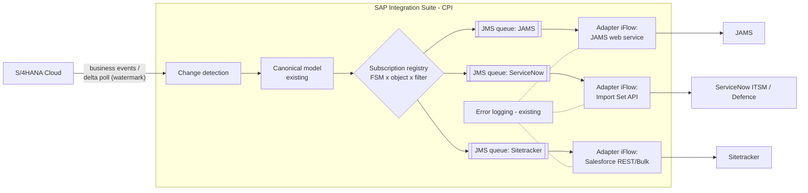

# FSM-Inbound Integrations — Option D research (CPI-side orchestration)

**Prepared by:** Rajesh Sha — for the Design Council working session, Friday
**Date:** 5 August 2026
**Status:** Research input, not a decision paper. Option B's core (JAMS moves from database
queries to API consumption) is confirmed and out of scope here. The open question is where
orchestration lives: in each FSM (Option B) or in CPI (Option D).

---

## 1. The question, restated

Ian's ask, made precise:

1. Can CPI **publish S/4 responses / S/4 data to all FSMs** with **no impact or no change on the
   FSM side**?
2. Is that an SAP CPI **data push/update pattern**, and is it recommended?
3. Most FSMs will need data updates. **If an FSM has no inbound API, what is the best way to
   handle it?**
4. Around **10 FSMs need data, but no FSM needs all of the data**. What is the best
   recommendation or approach for distributing subsets?

## 2. Position up front

**Option D is viable and should be the rule, with delivery mode as a per-FSM setting rather
than a per-FSM architecture.** The three FSMs named so far (JAMS, ServiceNow ITSM/Defence,
Sitetracker) can all receive a CPI push through endpoints they already ship with — no FSM-side
build. Where an FSM genuinely has no inbound path, the same distribution layer degrades to a
file drop or to the existing Response Type 2 pull endpoint for that one system. Nothing built
for the pull design is thrown away: the passthrough APIs, canonical model, JMS queue and error
logging all get reused underneath the new distribution layer.

The honest cost: CPI takes on a subscription registry, delta watermarks and per-FSM adapter
iFlows — more CPI build and a stronger CPI operating model. That is the trade Ian described,
and it concentrates skills in one team instead of spreading delta-pull logic across ten FSM
vendors.

## 3. What actually differs between B and D

Both options share the canonical model and the S/4 system APIs. The difference is one layer.

| Concern | Option B (FSM orchestrates) | Option D (CPI orchestrates) |
|---|---|---|
| Change detection (what's new in S/4?) | Each FSM runs its own delta pull on a schedule | CPI detects once, centrally (events or one delta poll) |
| Scheduling, retry, backoff | Built in each FSM, per vendor toolset | Built once in CPI (JMS redelivery, dead-letter) |
| Filtering to what this FSM needs | FSM composes `$filter` queries | CPI subscription registry routes subsets |
| Mapping canonical → FSM shape | FSM parses S/4 payloads | Per-FSM adapter iFlow in CPI |
| FSM must provide | APIs **plus** workflow (scheduler, delta logic, reconciliation) | APIs only |
| CPI is | An S/4 API wrapper with robustness | The orchestration layer (API-led: System–Orchestration–System) |
| Onboarding an acquired FSM | Modify the acquired FSM to do delta pulls | Add subscription rows + one adapter iFlow; FSM untouched if it has APIs |

Option B pushes a *different model* into every FSM later — Ian's point that it "won't be an
extension, it will be an entirely different model to change" is right: a pull-based FSM that
later needs near-real-time data has to rebuild its integration, whereas under Option D the FSM
contract (its own APIs) never changes.

## 4. Option D reference architecture in CPI

Three layers inside Integration Suite, only the third is new build:

**Change detection — two mechanisms, use both where they fit:**

- **S/4 business events.** S/4HANA Cloud raises standard business events (service order
  changed, invoice posted, project updated) natively into SAP Integration Suite **Advanced
  Event Mesh (AEM)**, which is built exactly for one-publisher/many-subscribers distribution.
  This is SAP's recommended event-driven pattern and gives near-real-time delivery without
  polling. Licensing note: AEM is a capability within our Integration Suite entitlement tier —
  I will confirm our tier covers it before Friday.
- **Central delta poll (no new licence).** Where an object has no usable event, one
  timer-based CPI iFlow polls the *existing* passthrough API with a change-date `$filter` and a
  stored watermark — the identical query the FSMs would each have written under Option B, run
  once instead of ten times.

**Distribution:** each detected change becomes one canonical message, fanned out by a
content-based router reading the subscription registry, onto a per-FSM JMS queue (retry,
sequencing per business object via `correlationId`, dead-letter on exhaustion), then through a
thin per-FSM adapter that maps canonical → that FSM's endpoint. The existing error-logging
iFlow covers the new layer unchanged.

**What state CPI holds — and what it deliberately doesn't:** watermarks and the subscription
registry (configuration), plus in-flight messages on queues. **No business data store.** This
matters because the ARB already flagged that any intermediate store becomes a system of record
with ownership, reconciliation and licensing attached. Option D as designed here is stateless
with respect to business data — S/4 stays the single source of truth.

## 5. Answering the four questions directly

### 5.1 Can CPI publish to all FSMs with no FSM-side change?

**For the FSMs we know about — yes, because they already expose inbound endpoints:**

- **ServiceNow (ITSM and Defence FSM):** the out-of-the-box **Import Set API** (staging table
  + transform map) or Table API accepts pushed records with configuration only — no scripted
  custom endpoint, no plugin development. ServiceNow's own guidance prefers Import Sets over
  custom Scripted REST APIs precisely because they avoid customisation and its support burden.
  Transform maps are ServiceNow admin configuration, not development.
- **Sitetracker:** Salesforce-native, so it inherits the standard Salesforce REST, SOAP and
  Bulk APIs across standard and custom objects — designed to be written to by middleware. No
  Sitetracker build; field mapping is done in the CPI adapter.
- **JAMS:** Trajce's read is that effort is equal either way — the direction just changes
  (expose a web service to receive posts vs build API pull). Under Option D JAMS builds one
  inbound endpoint per object; scheduling, deltas and retries all disappear from JAMS scope.

"No change" needs one honest caveat: every FSM needs **configuration** (credentials for CPI,
transform/field maps where the FSM does mapping its side) even when it needs no **build**.
The claim that survives scrutiny for Friday is: *no FSM development, configuration only,
wherever the FSM has a standard inbound API* — true for all three named systems.

### 5.2 Is this a recommended SAP CPI pattern?

Yes. This is textbook API-led / event-driven integration on SAP's own stack: S/4 events →
AEM/CPI → subscribed consumers is SAP's published reference architecture for distributing
master and transactional data to multiple systems simultaneously, and it aligns with the
clean-core principle already cited in the Option B recommendation. Option B's shape (every
consumer polls a wrapper API) is legitimate but is the *experience/system* pattern; the
orchestration tier sitting empty in the middle is exactly what Ian identified.

### 5.3 What if an FSM has no inbound API?

Use a ladder, best first — all served by the **same** distribution layer, so this is a per-FSM
delivery-mode setting, not a different architecture:

1. **Standard inbound API exists** (ServiceNow, Sitetracker, most modern SaaS): direct push
   via adapter iFlow. FSM config only.
2. **No API, but an import mechanism exists** (SFTP/CSV batch import, staging-table load —
   common in older FSMs): CPI's SFTP adapter drops files the FSM's existing import job
   consumes. Still no FSM development.
3. **Modest FSM-side appetite exists:** FSM stands up one thin receive endpoint (what JAMS is
   doing). Small, one-off, and the FSM's delta/scheduling burden still disappears.
4. **Nothing at all:** that FSM subscribes to the **existing Response Type 2 pull endpoint** —
   Option B survives as the documented exception for that system. The pull endpoint is already
   designed (contract ID + FSM job number, registered query per system), so this costs nothing
   extra.

What we should **not** do for a no-API FSM: build an intermediate database it reads from. That
recreates the JDW problem — the ARB's "additional considerations" already names it: any
intermediate store becomes a system of record in practice.

### 5.4 Ten FSMs, none needing all the data

This is the strongest argument *for* Option D. The answer is a **subscription registry**:
configuration (not code) declaring, per FSM: which canonical objects, scoped to which
contracts/systemIds, at what granularity, via which delivery mode. The content-based router
filters centrally, so:

- Each FSM receives only its subset — no FSM ever holds data it has no business need for,
  which matters most for **Defence** (data segregation enforced at the middleware, centrally
  auditable, rather than trusting ten FSMs to filter correctly on their side).
- Adding an object to an FSM later is a registry row, not a build.
- Under Option B the same requirement inverts badly: every FSM must compose correct filter
  queries, and we must trust and audit ten implementations of the filtering logic.

Illustrative registry (to validate with system owners Friday):

| Canonical object | JAMS | SN ITSM | SN Defence | Sitetracker | Future FSM |
|---|---|---|---|---|---|
| Service Orders | ✔ own contracts | ✔ | ✔ Defence contracts only | ? | per contract |
| Enterprise Project / WBS | ✔ | — | ✔ | ? | per contract |
| Customer Invoice | ✔ | — | — | ? | per contract |
| Supplier Invoice / RCTI | ✔ | — | — | — | per contract |
| Project Time & Equipment | ✔ | — | ✔ | ? | per contract |
| Available Stock | ✔ | — | ✔ | — | per contract |

## 6. The acquisition scenario, worked through

New company acquired, contracts onboarded into S/4, their FSM retained:

- **Option B:** modify the acquired FSM — build delta-pull scheduling, filter logic,
  reconciliation, retry — in an unfamiliar product, with a vendor we've just met, before it can
  see its own S/4 data. CPI change: near zero.
- **Option D:** discover what the FSM already exposes (API → rung 1; file import → rung 2;
  nothing → rung 4 fallback), add subscription rows, build one adapter iFlow in the team and
  toolset we already run. FSM change: credentials and field mapping config.

Same overall effort, but Option D's effort lands in a team we control, in one skill set,
repeatable per FSM — versus a bespoke build inside every acquired product forever.

## 7. Costs and risks of Option D (to table honestly)

- **CPI becomes an operational platform, not a wrapper.** Per-FSM queues need monitoring,
  alerting and a support runbook. Mitigation: this is one team's runbook instead of ten;
  existing error-logging extends to it.
- **AEM licensing/entitlement** for the event-driven leg — I'm confirming our Integration
  Suite tier. Fallback is the central delta poll, which needs no new licence.
- **Message volumes** count against Integration Suite metering; fan-out multiplies messages.
  Needs sizing against contract volumes — I'll bring an estimate Friday.
- **Canonical model versioning** now has ten consumers of pushed shapes; adapter iFlows
  isolate FSMs from canonical changes, but version discipline becomes mandatory.
- **Sequencing and idempotency**: pushes can arrive out of order or twice; adapters must key
  on correlationId/object ID and FSM endpoints must upsert (Import Set transform maps and
  Salesforce upsert both support this natively; JAMS endpoint must be specified as upsert).
- **Not a reason to delay JAMS**: the distribution layer can ship after go-live for the other
  FSMs; JAMS day-one scope is unchanged either way.

## 8. Data still to gather before Friday (owners per Ian's table)

- **Rajesh (CPI):** AEM entitlement in our Integration Suite tier; which S/4 standard business
  events exist for our six objects vs which need the delta poll; message-volume estimate;
  build estimate for registry + router + 3 adapters.
- **Trajce (JAMS):** confirm equal-effort read; whether JAMS's inbound endpoint would be
  upsert-capable; any sequencing constraints.
- **Chamila (ServiceNow ITSM + Defence):** confirm Import Set API is acceptable under Defence
  security posture; whether the S/4-driven process changes firm up the ITSM need.
- **Sitetracker owner (TBC — need a name):** whether any current-phase need exists; confirm
  API access tier in our Sitetracker licence.

## Sources

- [SAP S/4HANA integration with SAP Integration Suite, Advanced Event Mesh (SAP Community)](https://community.sap.com/t5/enterprise-resource-planning-blog-posts-by-sap/sap-s-4hana-integration-with-sap-integration-suite-advanced-event-mesh/ba-p/13577271)
- [Event-driven Architecture — SAP BTP Guidance Framework](https://help.sap.com/docs/sap-btp-guidance-framework/integration-architecture-guide/event-driven-architecture)
- [Designing Event-Driven Applications — SAP Architecture Center](https://architecture.learning.sap.com/docs/ref-arch/fbdc46aaae)
- [Advanced Event Mesh — SAP Integration Suite product page](https://www.sap.com/mena/products/technology-platform/integration-suite/advanced-event-mesh.html)
- [Enhance SAP with Advanced Event Mesh — Solace](https://solace.com/blog/enhance-sap-with-advanced-event-mesh/)
- [Import Set API — Goodbye SRAPIs? (ServiceNow Community)](https://www.servicenow.com/community/developer-articles/import-set-api-goodbye-srapis/ta-p/2318624)
- [Seamless ServiceNow Integrations Part 2 — Inbound Integrations (ServiceNow Community)](https://www.servicenow.com/community/servicenow-ai-platform-blog/seamless-servicenow-integrations-part-2-inbound-integrations/ba-p/3222406)
- [Sitetracker Integrations](https://www.sitetracker.com/products-services/integrations/)
- [Sitetracker on Salesforce AppExchange](https://appexchange.salesforce.com/appxListingDetail?listingId=a0N3A00000DvOROUA3)
