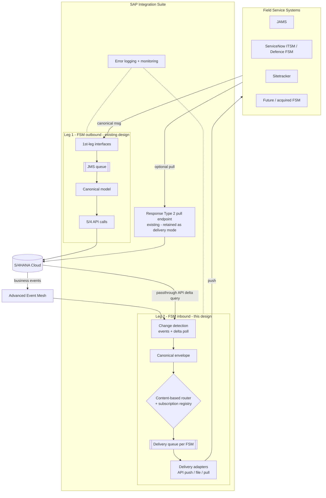

# Apollo FSM Integration — Target Architecture (Option D)

**Prepared by:** Rajesh Sha
**Date:** 5 August 2026
**Status:** Proposed target architecture for the Friday Design Council session. Builds on
`fsm-inbound-option-d-research.md`; assumes Option B's settled core (JAMS consumes APIs, not
database queries) and places orchestration in CPI per Option D.

---

## 1. Scope and principles

Covers both directions of FSM ↔ S/4HANA integration through SAP Integration Suite (CPI):

- **Leg 1 — FSM-outbound (already designed):** FSM sends a canonical message; CPI posts to
  S/4; the FSM receives acknowledgement + outcome callback (status + correlationId only).
- **Leg 2 — FSM-inbound (this design):** S/4 data back to the FSMs after processing. Option D
  replaces "every FSM pulls on its own schedule" with "CPI detects change once and delivers to
  each subscribed FSM in the mode that FSM can accept."

Principles carried through every section:

1. **CPI is the single integration layer.** No FSM touches an S/4 database or S/4 directly.
2. **S/4 is the single source of truth.** CPI holds configuration and in-flight messages only —
   never a business data store.
3. **One canonical model, per-FSM adapters.** FSM-specific knowledge lives in a thin adapter,
   not in the canonical or orchestration layers.
4. **Don't modify the FSMs unless needed.** FSMs expose what they already have; delivery mode
   bends to the FSM, not the reverse.
5. **Everything is per-FSM configuration, not per-FSM architecture.** Onboarding FSM #11 is
   registry rows plus one adapter, never a new pattern.

## 2. End-to-end context



Leg 1 is unchanged. Leg 2 adds four components (change detection, canonical envelope,
router + registry, delivery adapters) and retains the Response Type 2 pull endpoint as the
lowest rung of the delivery ladder.

## 3. Component inventory (Leg 2 build list)

| # | Component | Type | Build | Notes |
|---|---|---|---|---|
| C1 | Event ingestion | iFlow (AEM/Event Mesh consumer) | New | One per event-capable object; subscribes to S/4 business event topics |
| C2 | Delta poller | iFlow (timer) | New | One generic iFlow, parameterised per object; reuses existing passthrough APIs with change-date `$filter` + watermark |
| C3 | Watermark store | Data store (CPI variables/data store) | New | Object → last-processed change timestamp; the only Leg 2 state besides queues |
| C4 | Canonical envelope builder | iFlow (ProcessDirect) | New | Wraps object payload in the standard envelope (§6); enriches with contract ID / systemId |
| C5 | Subscription registry | Config (value mappings / partner directory) | New | FSM × object × filter × delivery mode × endpoint (§5) |
| C6 | Content-based router | iFlow | New | Evaluates registry; writes one message per matched subscription to that FSM's delivery queue |
| C7 | Delivery queues | JMS queues, one per FSM | Extend | Same JMS instance as Leg 1; retry/backoff + DLQ per FSM |
| C8 | Delivery adapter — JAMS | iFlow | New | Canonical → JAMS upsert web service |
| C9 | Delivery adapter — ServiceNow | iFlow | New | Canonical → Import Set API (staging table + transform map, config-only on SN side) |
| C10 | Delivery adapter — Sitetracker | iFlow | New (when needed) | Canonical → Salesforce REST upsert / Bulk API for volume |
| C11 | Delivery adapter — file | iFlow | New | Canonical → CSV/JSON to SFTP for import-mechanism FSMs |
| C12 | Pull endpoint | Existing Response Type 2 | Reuse | Delivery mode "pull" = no delivery adapter; FSM queries as already designed |
| C13 | Error logging | Existing | Extend | Same canonical error-logging iFlow; add per-queue DLQ alerting |
| C14 | Replay console | Runbook + iFlow | New (small) | Re-emit from DLQ or re-run delta window on demand (§8) |

Everything except C1 depends only on existing entitlements. C1 (event ingestion) needs the
AEM entitlement check; if it fails, C2 covers every object at lower freshness.

## 4. Change detection

Two mechanisms feed the same envelope builder, so downstream is identical either way.

**Events (preferred, near-real-time):** S/4HANA raises standard business events (service
order changed, billing document posted, project updated) to Advanced Event Mesh. One CPI
consumer per topic. Events carry keys, not full payloads — on receipt, C1 calls the existing
passthrough API for the full object, which also guarantees we always distribute current state
(resolves out-of-order events: last read wins).

**Delta poll (fallback and gap-filler):** C2 runs per object on a timer (proposed: 5 min for
service orders / stock, 15 min for projects, hourly for invoices — to be validated Friday),
querying the passthrough API with `ChangedDateTime gt {watermark}`, paging with `$top`/skip
token, advancing the watermark only after all pages land on delivery queues. This is exactly
the query each FSM would have written under Option B, run once.

**Both mechanisms are per-object switches**, so each of the six objects independently uses
whichever is available — events where S/4 raises them, poll where it doesn't.

## 5. Subscription registry

The registry is configuration (CPI value mappings or partner directory — decision at build
time), owned by the integration team, changed via transport, auditable. Schema:

| Field | Example | Notes |
|---|---|---|
| `fsmId` | `SN-DEFENCE` | One per consuming system |
| `object` | `SERVICE_ORDER` | Canonical object name |
| `contractScope` | `CCR-145.*, DEF-*` | Contract ID patterns this FSM may receive — the security boundary |
| `fieldScope` | `full` \| named field set | Optional projection for FSMs that must not see all fields |
| `deliveryMode` | `API_PUSH` \| `FILE` \| `PULL` | Rung on the delivery ladder |
| `endpointRef` | credential + URL alias | Resolved by the delivery adapter |
| `active` | `true` | Kill-switch per subscription without transport |

Starting registry (from the research paper's matrix — validate with owners Friday):
JAMS subscribes to all six objects scoped to its contracts; ServiceNow Defence to service
orders, projects, time & equipment, and stock scoped to Defence contracts only; ServiceNow
ITSM to service orders (pending Chamila's confirmation); Sitetracker TBC.

**Filtering is enforced here, centrally.** An FSM physically never receives a message outside
its contract scope — the Defence segregation argument, and the audit story, in one place.

## 6. Message design

Every delivered message (and every file row) carries the canonical envelope:

```json
{
  "envelope": {
    "messageId": "uuid — unique per delivery",
    "correlationId": "S/4 object key + change sequence — the idempotency key",
    "object": "SERVICE_ORDER",
    "objectKey": "0000000229",
    "contractId": "CCR-145.3052025-Tel",
    "systemId": "target fsmId",
    "changedAt": "S/4 ChangedDateTime",
    "emittedAt": "CPI processing time",
    "schemaVersion": "1.0"
  },
  "payload": { "canonical object per the existing canonical model" }
}
```

- **Idempotency:** receivers upsert on `objectKey`. Duplicate delivery is safe by design
  (Import Set transform maps coalesce on key; Salesforce upserts on external ID; the JAMS
  endpoint is specified as upsert — Trajce to confirm).
- **Ordering:** per-object-key sequencing on the delivery queue; because payloads are read
  fresh from S/4 at emission (§4), a late message never carries stale state older than an
  already-delivered one with a higher `changedAt` — adapters drop deliveries whose
  `changedAt` is older than the last applied (last-write-wins guard).
- **Versioning:** `schemaVersion` is mandatory; canonical changes are additive within a major
  version; adapters isolate FSMs from canonical evolution.

## 7. Delivery ladder (per-FSM setting, one architecture)

| Rung | When | Mechanism | FSM effort |
|---|---|---|---|
| 1. API push | FSM has a standard inbound API | C8/C9/C10-style adapter | Configuration only (credentials, field/transform maps) |
| 2. File | FSM has an import job but no API | C11 file adapter → SFTP | Point existing import at the drop folder |
| 3. Thin endpoint | FSM team can build one small receiver | FSM builds one upsert endpoint (the JAMS case) | One-off small build; no scheduler/delta logic |
| 4. Pull | FSM has nothing and no appetite | Existing Response Type 2 endpoint | FSM builds pull — the documented exception |

Current placement: **ServiceNow (ITSM + Defence) → rung 1** (Import Set API), **Sitetracker →
rung 1** (Salesforce REST/Bulk), **JAMS → rung 3** (agreed direction), **acquired FSMs →
assessed against the ladder during onboarding (§11)**.

Explicitly excluded at every rung: any intermediate business database (recreates the
JDW/system-of-record problem the ARB flagged), and **any direct write into an FSM's own
database**. To be precise: CPI *can* technically do this — the Integration Suite JDBC
receiver adapter runs INSERT/UPDATE/DELETE and stored procedures against Oracle, MS SQL
Server, DB2, PostgreSQL, HANA and others, including on-premise databases via SAP Cloud
Connector — so capability is not the constraint, and "CPI can't" is the wrong argument.
SAP's own guidance (ISA-M, clean-core integration) is API-first and event-first, with JDBC
positioned for legacy/edge cases such as staging tables or databases you own outright.
Beyond that, direct DB write is impossible for the SaaS FSMs (ServiceNow and
Sitetracker/Salesforce never expose their databases — APIs are the only inbound path) and
wrong for the rest: it bypasses the application's validations, workflows, security rules and
audit history; couples the integration to an internal schema that changes on every vendor
upgrade; puts vendor support for the affected data at risk; and is a named
enterprise-integration anti-pattern ("Integration databases: don't do it" — Nygard,
*Release It!*). The rung 3 upsert endpoint delivers the same outcome through the
application's own logic at equal effort.

## 8. Delivery semantics, errors, and replay

- **Retry:** JMS redelivery with exponential backoff per delivery queue (proposed
  2s/4s/8s… capped, max ~10 attempts over ~1h) — transient FSM outages self-heal.
- **Dead-letter:** exhausted messages land on the FSM's DLQ; DLQ depth > 0 raises an alert
  tagged to that FSM's support owner. One FSM being down never blocks another (isolated
  queues).
- **Replay:** C14 re-emits from DLQ after the FSM recovers, or re-runs a delta window
  (`ChangedDateTime` between X and Y) for bulk catch-up — also the mechanism for initial
  load / re-sync of a newly onboarded FSM.
- **Reconciliation:** because payloads are read from S/4 at emission and receivers upsert,
  a periodic (weekly) count-and-checksum comparison per object per FSM is sufficient; no
  record-level sync store needed.
- **Error logging:** the existing canonical error-logging iFlow is extended with Leg 2
  message context (fsmId, object, objectKey, rung) — one monitoring pane for both legs.

## 9. Security

- **Transport:** TLS everywhere; per-FSM credentials held in CPI's secure store, one
  credential alias per `endpointRef` — no shared credentials across FSMs.
- **AuthN per rung:** OAuth 2.0 where the FSM supports it (ServiceNow, Salesforce/Sitetracker),
  basic + IP allow-listing only where unavoidable; SFTP with key auth for rung 2.
- **Data segregation:** enforced at the router by `contractScope` (§5) — Defence data cannot
  reach a non-Defence queue. `fieldScope` projections cover FSMs that may see an object but
  not all of its fields.
- **Audit:** registry changes go through transport (change-controlled); message processing
  logs carry contractId + fsmId, so "which system received which contract's data when" is
  answerable from CPI monitoring alone.

## 10. Non-functionals and environments

- **Freshness tiers:** events → seconds; polled objects → poll interval. Per-object tiers are
  a Friday input (JAMS operational checks drive the tightest tier).
- **Volumes:** fan-out multiplies messages (1 change × N subscribers). Sizing estimate against
  contract volumes is my open action; Integration Suite metering is the constraint to price.
- **Throughput:** delta pages capped via `$top`; Bulk API used for Sitetracker volume loads;
  initial loads run through C14 windows, not the live queues.
- **Environments:** DEV → TEST → PROD via standard CPI transport; the registry transports with
  the iFlows; per-environment endpoint aliases keep FSM test instances isolated.
- **Availability:** CPI/JMS HA per Integration Suite SLA; FSM outages absorbed by queues
  (retention sized to cover a weekend outage).

## 11. FSM onboarding runbook (the repeatable pattern)

Adding any FSM — including an acquisition — is the same five steps, no new architecture:

1. **Assess** the FSM against the delivery ladder (what inbound paths exist?).
2. **Register:** add subscription rows (objects × contract scope × mode × endpoint).
3. **Adapt:** build/configure one delivery adapter (or none, for rungs 2 and 4).
4. **Load:** initial sync via a C14 delta window.
5. **Verify:** reconciliation counts + DLQ empty for one cycle; then go live.

Target: an onboarding measured in weeks of CPI work, with FSM effort limited to credentials
and field mapping — the concrete answer to the acquisition scenario.

## 12. Build packages and sequencing

| Package | Contents | Depends on | When |
|---|---|---|---|
| P0 | AEM entitlement check; event availability per object; volume sizing | — | Before Friday (Rajesh) |
| P1 | Core spine: C2 delta poller, C3 watermarks, C4 envelope, C5 registry, C6 router, C7 queues, C13 logging | Existing passthrough APIs | First build increment |
| P2 | JAMS adapter (C8) + JAMS upsert endpoint | P1; Trajce's endpoint | Aligned to JAMS go-live scope |
| P3 | ServiceNow adapter (C9) + Defence scope validation | P1; Chamila's confirmations | When ITSM/Defence need firms up |
| P4 | Event ingestion (C1) upgrade for event-capable objects | P0 outcome | Can follow go-live — P1 alone is functionally complete |
| P5 | File adapter (C11), replay console (C14), Sitetracker adapter (C10) | P1 | As demanded |

Key sequencing point for Friday: **P1+P2 is the JAMS day-one scope and does not depend on the
event mesh** — the AEM question improves freshness later but gates nothing.

## 13. Open items (carried from the research paper)

- AEM entitlement in our Integration Suite tier; standard event availability for our six
  objects (Rajesh).
- JAMS inbound endpoint is upsert-capable; sequencing constraints (Trajce).
- Import Set API acceptability under Defence security posture; ITSM need confirmation
  (Chamila).
- Sitetracker owner to be named; current-phase need; API access tier in our licence.
- Freshness tier per object; volume estimate; registry storage mechanism (value mapping vs
  partner directory) — build-time decision.
